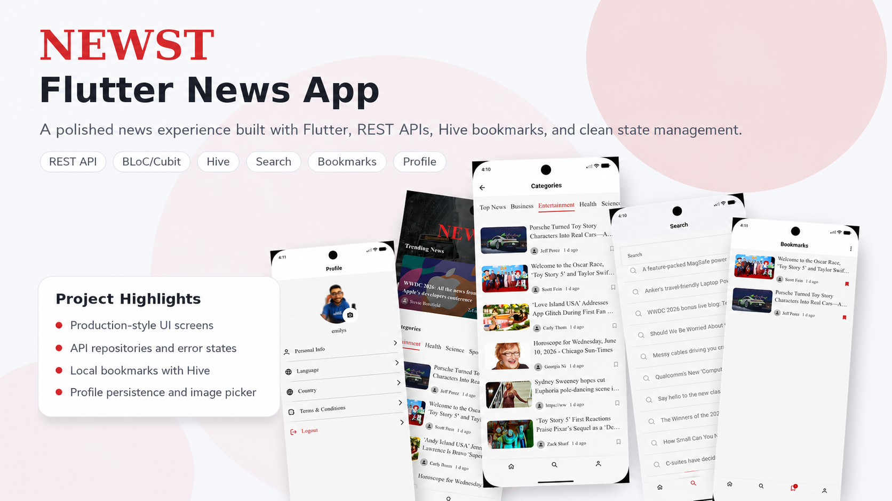
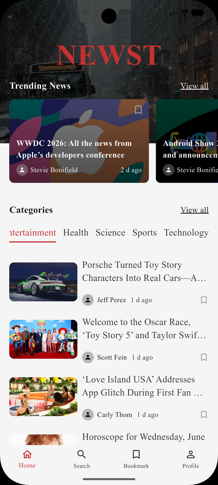
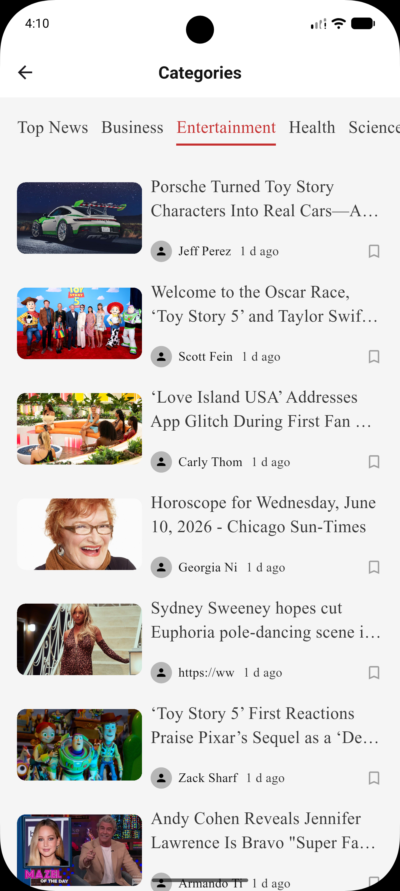
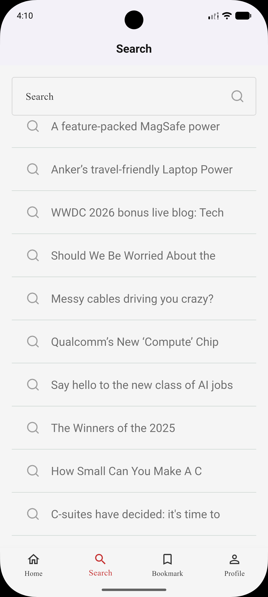
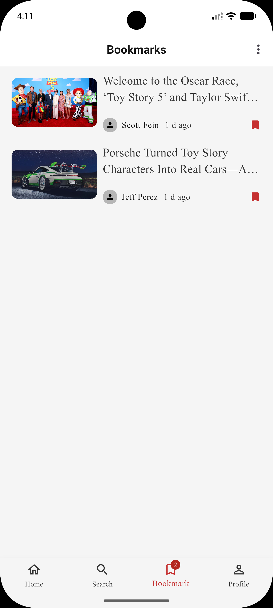
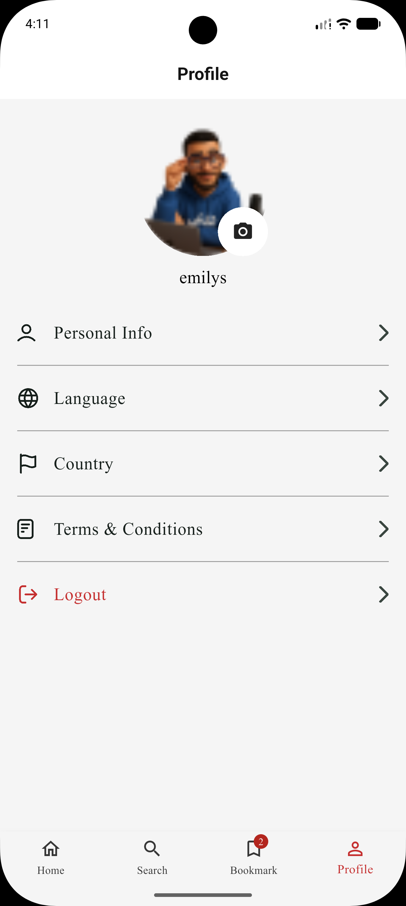
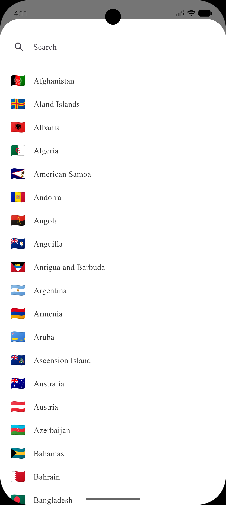
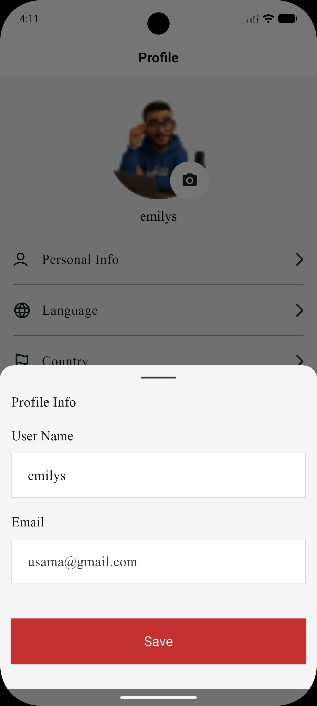
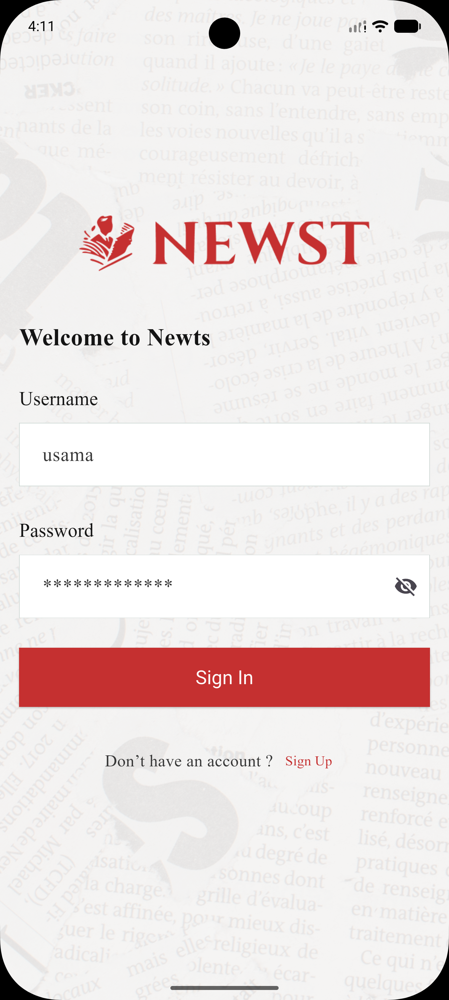

# 📰 NEWST – Flutter News App

> A **production-style Flutter news application** demonstrating practical mobile development skills including API integration, Dio networking, clean architecture patterns, local storage, state management, and reusable component design.

---

## ✨ Project Highlights

This portfolio project showcases:

- ✅ **Professional Dio Networking** – HTTP client with interceptors, error handling, and timeouts
- ✅ **Feature-First Architecture** – Clean folder organization with repository pattern
- ✅ **State Management** – Flutter BLoC for reactive UI updates
- ✅ **Local Storage** – Hive for bookmarks and user preferences with Shared Preferences
- ✅ **Complete User Flows** – Authentication, onboarding, profile management, search
- ✅ **Responsive Design** – ScreenUtil for mobile-first layouts
- ✅ **Reusable Components** – Custom widgets following Flutter best practices
- ✅ **Error Handling** – Graceful management of network failures and edge cases

---

## 🎯 Features

### User Management
- **Authentication UI** – Sign up, sign in, password reset screens
- **Profile Management** – Edit profile, profile picture (image picker), country/language selection
- **Onboarding** – First-time user experience with carousel navigation
- **Session Persistence** – User data persists across app restarts (Hive + SharedPreferences)

### News Discovery
- **Top Headlines** – Browse trending news by category
- **Search** – Query news by keyword
- **Category Filtering** – Entertainment, Health, Science, Sports, Technology, and more
- **Article Details** – Full article view with author and publication date

### Bookmarks & Personalization
- **Save Articles** – Bookmark favorite articles (Hive local storage)
- **Bookmarks Screen** – View saved articles anytime
- **Language Selection** – Multi-language support (Country picker included)
- **Persistent Preferences** – Theme, language, and user data saved locally

### Networking & API
- **REST API Integration** – Powered by [NewsAPI.org](https://newsapi.org)
- **Professional Dio Setup** – Configured with timeouts, custom headers, and interceptors
- **API Key Interceptor** – Automatic authentication header injection
- **Logging Interceptor** – Request/response logging for debugging
- **Smart Error Handling** – User-friendly messages for connection, timeout, and server errors

---

## 🏗️ Architecture & Code Structure

### Design Pattern: **Feature-First + Repository Pattern**

This project organizes code by features (not layers), making it scalable and maintainable for small to medium teams.

```
lib/
├── main.dart                          # App entry point
├── core/                              # Shared across features
│   ├── constants/                     # App-wide constants
│   ├── datasource/
│   │   ├── remote_data/               # API layer
│   │   │   ├── news/
│   │   │   │   ├── news_api_config.dart          # API endpoints & keys
│   │   │   │   ├── news_dio_config.dart          # Dio setup
│   │   │   │   └── news_api_service.dart         # API calls
│   │   │   ├── auth/                             # Auth API
│   │   │   └── interceptors/
│   │   │       ├── api_key_interceptor.dart      # Auto-attach API key
│   │   │       └── logging_interceptor.dart      # Request/response logs
│   │   └── local_data/                # Local storage layer
│   │       ├── preference_manager.dart            # SharedPreferences
│   │       └── user_repository.dart               # Hive storage
│   ├── repos/
│   │   └── news_repository.dart       # Business logic (fetch, parse, error handling)
│   ├── models/                        # Shared data models
│   ├── theme/                         # App colors, fonts, themes
│   ├── widgets/                       # Reusable UI components
│   ├── validation/                    # Input validation logic
│   ├── enums/                         # Enumerations
│   └── extensions/                    # Dart extensions
│
└── features/                          # Feature modules (each self-contained)
    ├── splash/                        # Splash screen
    ├── onboarding/                    # Onboarding flow
    ├── auth/                          # Authentication (signin, signup, etc.)
    ├── home/                          # News feed, top headlines
    │   ├── models/
    │   ├── controllers/               # BLoC/state management
    │   ├── widgets/
    │   └── screens/
    ├── search/                        # Search functionality
    ├── details/                       # Article details screen
    ├── bookmark/                      # Saved articles
    │   ├── data/
    │   └── ui/
    ├── profile/                       # User profile & settings
    └── main/                          # Main app shell (navbar, routing)
```

### Data Flow: **Repository → BLoC → UI**

```
UI Screen (Flutter Widget)
    ↓
BLoC (Business Logic) – emits states
    ↓
Repository (Business Rules) – fetches data
    ↓
API Service (Dio) – makes HTTP calls
    ↓
Local Storage (Hive/SharedPreferences) – caches data
```

---

## 🛠️ Tech Stack

| Layer | Technology |
|-------|-----------|
| **UI Framework** | Flutter 3.11+, Material Design 3 |
| **Networking** | Dio 5.9.2 (HTTP client with interceptors) |
| **State Management** | Flutter BLoC 9.1.1 (reactive, event-driven) |
| **Local Storage** | Hive 2.1.0 (NoSQL), SharedPreferences 2.5.5 |
| **UI Components** | ScreenUtil (responsive), CachedNetworkImage, Shimmer |
| **Code Generation** | build_runner, Hive generator |
| **API** | [NewsAPI.org](https://newsapi.org) – free tier available |
| **Linting** | flutter_lints 6.0.0 |
| **IDE** | Android Studio, VS Code, Xcode |

---

## 🚀 Getting Started

### Prerequisites
- **Flutter SDK**: 3.11.3 or higher
- **Dart SDK**: 3.11.3 or higher
- **Android**: Android 5.0+ (API 21+)
- **iOS**: iOS 11.0+
- **NewsAPI.org Account**: Free tier

### Installation & Setup

**1. Clone the repository**
```bash
git clone https://github.com/YOUR_USERNAME/news_app.git
cd news_app
```

**2. Get your NewsAPI key**
- Visit [https://newsapi.org/register](https://newsapi.org/register)
- Sign up for a free account (instant activation)
- Copy your API key

**3. Add API key to the project**
```bash
# Open this file:
lib/core/datasource/remote_data/news/news_api_config.dart

# Replace the placeholder:
static const String apiKey = 'YOUR_NEWS_API_KEY_HERE';  // ← Paste your key here
```

**4. Install dependencies**
```bash
flutter pub get
```

**5. Run code generation (for Hive models)**
```bash
dart run build_runner build --delete-conflicting-outputs
```

**6. Run the app**
```bash
# List available devices
flutter devices

# Run on Android/iOS emulator
flutter run

# Run on specific device
flutter run -d <device_id>
```

---

## 📸 Screenshots

### 🎨 App Mockup

<div align="center">
  
  <h4>NEWST is a polished Flutter news experience with clean UI, search, bookmarks, and profile persistence.</h4>
  <p><i>Designed for portfolio presentation and recruiter-friendly first impressions.</i></p>
</div>

### 📱 App Screens in Action

<table>
  <tr>
    <td align="center"><b>Screen 1</b></td>
    <td align="center"><b>Screen 2</b></td>
    <td align="center"><b>Screen 3</b></td>
  </tr>
  <tr>
    <td></td>
    <td></td>
    <td></td>
  </tr>
  <tr>
    <td align="center"><b>Screen 4</b></td>
    <td align="center"><b>Screen 5</b></td>
    <td align="center"><b>Screen 6</b></td>
  </tr>
  <tr>
    <td></td>
    <td></td>
    <td></td>
  </tr>
  <tr>
    <td align="center"><b>Screen 7</b></td>
    <td align="center"><b>Screen 8</b></td>
    <td></td>
  </tr>
  <tr>
    <td></td>
    <td></td>
    <td></td>
  </tr>
</table>

> All screenshots showcase the app's UI across different features: onboarding, authentication, home feed, search, bookmarks, and profile management.

---

## 🧪 Testing

### Run Tests
```bash
# Run all tests
flutter test

# Run specific test file
flutter test test/widget_test.dart

# Run with coverage (requires coverage package)
flutter test --coverage
```

### Code Quality Checks
```bash
# Static analysis
flutter analyze

# Format code (auto-fixes style)
dart format lib/

# Check for issues
flutter pub publish --dry-run
```

---

## 📚 What I Learned

This project demonstrates understanding of:

✅ **HTTP Networking**
- Dio setup, configuration, and best practices
- Interceptor pattern for cross-cutting concerns (logging, authentication)
- Comprehensive error handling (DioException types)
- Timeout management and retry logic

✅ **State Management**
- Flutter BLoC pattern for separation of concerns
- Event-driven architecture
- Stream management and disposal

✅ **Local Storage**
- Hive for structured NoSQL storage (bookmarks, models)
- SharedPreferences for simple key-value pairs (user settings)
- Model serialization (toJson/fromJson)

✅ **Architecture Patterns**
- Repository pattern (separation of data sources)
- Abstract base classes for dependency injection
- Feature-based folder organization
- DRY principle and reusable components

✅ **Flutter Best Practices**
- Responsive design with ScreenUtil
- Proper widget composition
- Error handling and user feedback
- Performance optimization (CachedNetworkImage, Shimmer loading)

✅ **UI/UX**
- Material Design 3 principles
- Image loading states (shimmer effects)
- Carousel navigation (smooth_page_indicator)
- Responsive layouts for various screen sizes

✅ **Code Organization**
- Clean git history with meaningful commits
- Proper .gitignore configuration
- Separation of concerns (models, services, repos)
- Type-safe abstractions

---

## 🎯 For Recruiters

### Why This Project?

This is **not a toy app**—it's a *production-style foundation* for a real news platform. Every decision (architecture, error handling, code organization) reflects professional Flutter development:

- **Scalable**: Easy to add new features without touching existing code
- **Maintainable**: BLoC + repository pattern prevents spaghetti code
- **Testable**: Abstract base classes enable mocking and unit tests
- **Production-Ready**: Proper error handling, timeouts, and user feedback
- **Junior Dev Friendly**: Clean code that's easy to read and contribute to

### Key Takeaways

1. **I understand mobile networking** – Dio interceptors, error handling, timeouts
2. **I write clean, organized code** – Feature-first architecture, repository pattern
3. **I handle state properly** – BLoC pattern for reactive updates
4. **I think about UX** – Shimmer loading, error messages, responsive layouts
5. **I follow best practices** – Type safety, abstract classes, code reuse

### In a Team

- I'd **integrate backend changes** quickly (API layer is abstracted)
- I'd **add features without breaking** existing code (clear boundaries)
- I'd **help other devs navigate** the codebase (consistent naming, structure)
- I'd **contribute to code review** with clear feedback on patterns and practices

---

## 🔮 Future Improvements

Potential enhancements (not yet implemented):

- [ ] **Offline Support** – Cache articles for reading without internet
- [ ] **Notifications** – Push notifications for breaking news
- [ ] **Dark Mode** – Theme switching and persistent preference
- [ ] **Unit Tests** – 80%+ code coverage for repositories and BLoCs
- [ ] **Integration Tests** – End-to-end user flow testing
- [ ] **Analytics** – Track user behavior (Firebase Analytics)
- [ ] **Pagination** – Infinite scroll for news feeds
- [ ] **API Retry Logic** – Exponential backoff for failed requests
- [ ] **Multi-language** – i18n support for UI strings
- [ ] **Social Sharing** – Share articles via WhatsApp, Twitter, etc.

---

## 📄 License

This project is open source and available under the [MIT License](LICENSE).

---

## 👤 Author

**Fawzi Mohammed**
- GitHub: [@Fawzi-Mohammed](https://github.com/Fawzi-Mohammed)
- LinkedIn: [Fawzi Mohammed](https://linkedin.com/in/fawzi-mohammed)
- Email: [fawzi@example.com](mailto:fawzi@example.com)

---

## 🤝 Contributing

Contributions are welcome! To contribute:

1. Fork this repository
2. Create a feature branch (`git checkout -b feature/amazing-feature`)
3. Commit your changes (`git commit -m 'add amazing feature'`)
4. Push to the branch (`git push origin feature/amazing-feature`)
5. Open a Pull Request

---

## 📞 Support & Questions

For questions or feedback:
- Open an [issue](https://github.com/Fawzi-Mohammed/news_app/issues)
- Start a [discussion](https://github.com/Fawzi-Mohammed/news_app/discussions)
- Email: [fawzi@example.com](mailto:fawzi@example.com)

---

**Made with ❤️ by Fawzi Mohammed** | *Crafted for production, built for learning*
